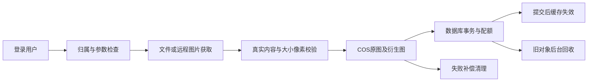

# 简历表述与面试复盘

## 先把来源和个人工作讲清楚

推荐开场：项目基础来自程序员鱼皮的智能云图库教学项目，自己在 Star Picture 仓库实现和完善了权限边界、上传校验、事务配额、缓存故障处理、登录密码兼容和 AI 扩图任务闭环。讲解时结合代码、隔离测试和提交记录，不把教学项目的整体设计当作原创成果。

可以使用以下简历表述，按真实熟悉程度取舍：

- 基于 Spring Boot、MyBatis-Plus、MySQL、Redis 与 COS 实现公共图库和个人私有空间，支持本地/URL 上传、WebP 与缩略图处理、批量管理及多维检索；统一校验图片归属和审核可见性。
- 使用事务、行锁和条件更新处理空间配额，按替换差额更新用量；补充失败补偿、原图 Key 记录及回归测试，覆盖并发超额、回滚、删除释放等场景。
- 为公共审核列表接入 Caffeine 与 Redis 两级缓存，规范缓存键、增加 TTL 抖动、事务提交后失效和 Redis 故障降级；明确以 TTL 约束陈旧数据的最终一致性边界。
- 实现 AI 异步扩图的本地任务管理、用户额度、授权查询与幂等保存，结果复用现有上传和配额链路；新增密码 BCrypt/旧 MD5 渐进升级，并提供 CI 与单机部署模板（远端 CI 尚未启用）。

当前 64 项隔离回归测试通过，真实 COS/Redis/MySQL/AI 联调尚未完成，应说“实现并通过隔离回归验证，真实服务待联调”，不要说已经稳定上线。没有可复现的压测报告时，不写吞吐量、延迟下降比例或存储节省百分比。

## 可以沿着这条链路讲

COS 不参加数据库事务，因此无法通过 `@Transactional` 同时回滚云端对象。这里采用先上传、事务写入、失败清理和提交后回收旧图的流程；后台重试仍属于尽力补偿，突然退出存在孤儿对象风险。先说明这个限制，再解释若进一步完善，可以使用数据库持久任务/Outbox 和定期对账，而不要把未实现的方案描述成现有功能。

## 高频追问

| 问题 | 建议回答与代码依据 |
| --- | --- |
| 私有图片的权限在哪一层校验？ | Controller/Service 检查用户和空间归属，列表强制空间过滤，缓存不接入私有列表；COS 私有对象 ACL 和短期签名 URL 控制存储访问。数据库过滤与桶权限需要同时成立。对应 `PictureController`、`SpaceServiceImpl`、`CosManager`。 |
| `@AuthCheck` 能替代资源权限吗？ | 它负责角色检查，例如管理员接口；图片/空间归属属于资源级权限，需要另外检查。不能因为调用者已登录就允许操作任意图片 ID。 |
| 管理员审核时图片被替换怎么办？ | 审核请求推荐带页面读取到的 `expectedUrl`，服务还对已读内容做条件更新；源图改变则拒绝旧页面审核。没有传入页面版本时，无法证明管理员看到的是哪一版。 |
| 为什么计数不能先查后写？ | 并发请求可能同时看到剩余额度。事务中锁空间/图片，并使用带上限条件的数据库更新；替换按新旧大小差额计费，删除减少当前用量。H2 用例验证事务流程，MySQL 的锁与死锁行为需要真实环境验收。 |
| 创建空间如何跨进程防重复？ | JVM 中同步只覆盖单进程，事务内锁用户行才能让多个实例串行检查和创建空间；数据库锁与权限/配额事务配合，不能只用 `synchronized` 解释跨实例保证。对应 `SpaceServiceImpl`。 |
| 空间删除或缩容如何处理？ | 非空空间禁止直接删除，先删图释放配额；缩后的上限不能低于当前用量。已经超额的历史空间仍允许删除，避免无法释放。 |
| 为什么不信 URL 的 Content-Type 和 Content-Length？ | 这些头可以缺失或伪造。先做 HEAD/类型/大小预检，再用 GET 流式读取累计上限，最终解析真实图片并限制像素数；超限及时终止。对应 `UrlPictureUpload`、`PictureUploadTemplate`。 |
| URL 上传是否已经完全阻止 SSRF？ | 实现协议/端口限制、地址检查、禁用重定向及可配置主机白名单；DNS 检查与连接间仍有时间差，生产示例要求非空可信主机白名单并配合出口网络约束，不能宣称彻底解决 DNS 重绑定。对应 `RemoteImagePolicy`。 |
| 为什么图片 Key 要独立？ | WebP 衍生图不覆盖原图，记录 `originalKey` 才能在替换/失败后回收完整对象集合；历史缺失原图 Key 的对象不能凭空恢复。对应 `CosManager`、`PictureFileCleanup`。 |
| 两级缓存为什么只缓存公共列表？ | 私有数据依赖用户/空间授权，且包含短期签名 URL；公共审核列表更适合共享缓存。受限、规范化的查询参数也减少键数量和解析歧义。对应 `PublicPictureCache`。 |
| 写入之后何时失效？ | 在数据库事务提交后失效，回滚不提前删除缓存；版本变化使旧缓存不再被读取。Redis 故障时降级，恢复标记存在本进程；故障加进程退出时仍可能有 TTL 范围的陈旧结果；L1 2 分钟，L2 随机 5～10 分钟；L2 到期前重新回填 L1 还可能延续 2 分钟，不能把 10 分钟称为整体硬上限。这是最终一致性。 |
| Redis 故障会影响什么？ | 公共列表缓存会降级数据库；登录 Session 也存 Redis，不能把缓存降级等同于整个系统完全可用。需要分别验证两条链路。 |
| 为什么改成 BCrypt？旧账号怎么办？ | BCrypt 为每次哈希生成随机盐并增加计算成本，新注册直接使用；旧 MD5 正确登录后用包含旧哈希的条件更新迁移，避免覆盖并发密码修改；成功登录轮换 Session ID。72 个 UTF-8 字节上限避免 BCrypt 截断歧义。对应 `UserServiceImpl`。 |
| AI 为什么有自己的本地任务？ | 云端生成是异步操作，本地记录关联用户、源图、所属空间和状态，避免泄漏供应商任务 ID；查询/保存都验证任务归属，结果保存复用上传与配额逻辑。对应 `OutPaintingServiceImpl` 和任务表。 |
| AI 额度为什么先预留？ | 在用户行锁事务内预留活动任务和当天次数，再请求供应商；失败提交也计当天次数，防止不断重试创建无界付费任务。创建付费任务默认仅管理员可用，普通账号需 ID 明确授权，防止开放注册绕过每人额度；额度只保护本系统，供应商侧费用仍需监控。 |
| AI 保存重试会多出一张图吗？ | 保存路径持任务行锁下载结果并写入，使用任务状态和已保存图片记录约束并发；这个简单方案会延长数据库事务与行锁占用时间，需真实联调观察；同一个任务再次保存返回同一图片。真实结果下载/COS失败仍需验证补偿边界。 |
| 异步任务线程池有什么取舍？ | 固定核心/最大线程和有界队列，拒绝策略由调用线程执行提供背压；避免无界堆积，但可能增加请求延迟。关闭等待有时限，硬停没有持久重试保证。对应 `AsyncConfig`。 |
| CI 和当前测试分别证明了什么？ | 当前本地64项隔离测试与打包已通过；CI 模板因推送令牌缺少 workflow 权限尚未启用，不能说远端 CI 已通过。启用后可在无真实密钥环境复现并检查私密配置没有进入 JAR；Mock/H2/local HTTP 仍不能替代真实云服务、MySQL锁或公网部署验收。 |

## AI 演示的顺序

1. 开启前确认供应商工作空间、额度与服务器配置，以及管理员身份或 `AI_OUT_PAINTING_ALLOWED_USER_IDS` 中的明确账号授权，避免把密钥放入演示前端。默认关闭的模块应返回可理解的业务错误。
2. 登录并选择自己有权限操作的源图，创建任务，记住返回的本地 ID。
3. 查询本地任务，观察 `PENDING/RUNNING/SUCCEEDED`；用第二个账号验证任务隔离。
4. 成功后先预览临时结果，再保存到源图所属空间；白名单需包含实际 AI 结果域名，否则下载会被拒绝；重复保存应返回相同图片。
5. 展示失败、每日次数、活动任务上限、过期和配额不足的处理。真实请求需控制次数，隔离测试可以使用模拟供应商。

最终接口和状态以代码为准：创建 `POST /api/picture/out_painting/create_task`，查询 `GET /api/picture/out_painting/get_task?taskId=本地ID`，保存 `POST /api/picture/out_painting/save`。供应商任务 ID 不应传给前端；成功查询返回的结果 URL 不是永久图库地址。

## 若要写性能数据，需要补什么

固定数据量、图片分布、并发数、机器资源、MySQL/Redis/COS网络条件和测试脚本；分别测缓存冷启动/命中/失效/故障、上传正常/替换和 AI 查询。记录吞吐量、P50/P95/P99、错误率、数据库查询量、CPU/内存及费用，并保留原始结果。只有在同等环境、有可重复对照后，才可填写收益数值；当前仓库不包含这种压测结论。